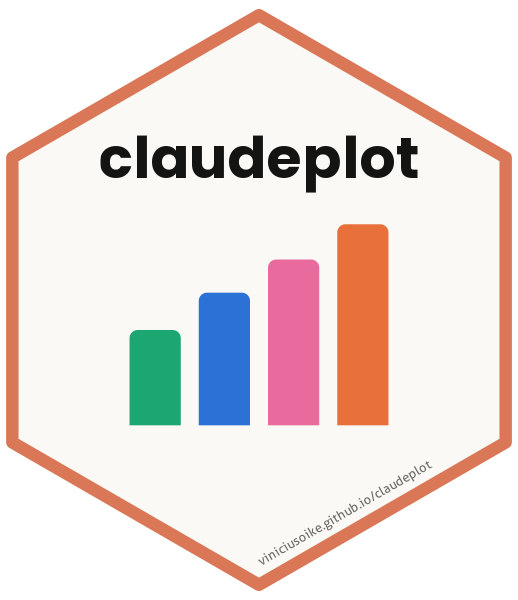
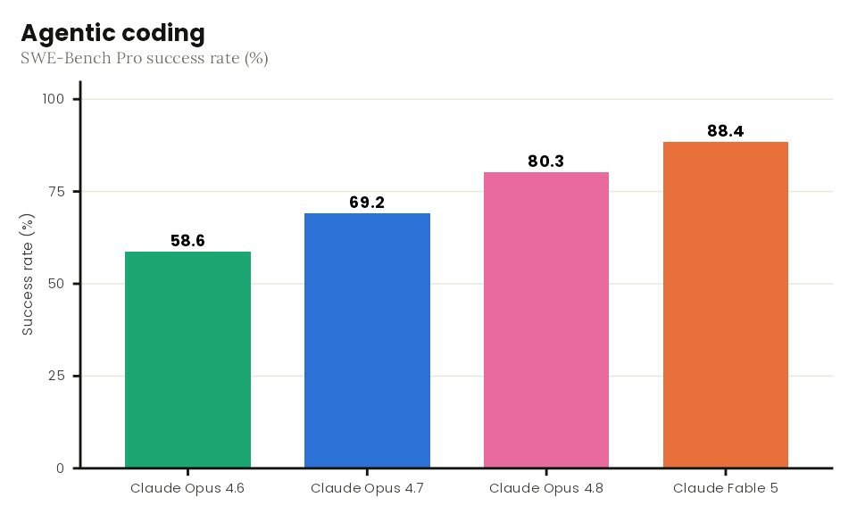
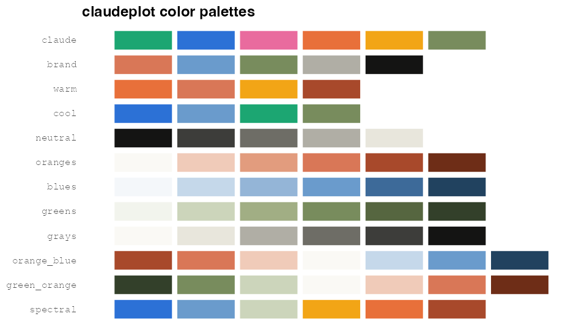

<!-- README.md is generated from README.Rmd. Please edit that file -->

# claudeplot 

<!-- badges: start -->

[](https://lifecycle.r-lib.org/articles/stages.html#experimental)
<!-- badges: end -->

**claudeplot** brings the visual language of
[Anthropic](https://www.anthropic.com) and Claude to `ggplot2`. It gives
you a clean, publication-ready theme, color palettes drawn from
Anthropic’s brand and its data-visualization style, discrete and
continuous color/fill scales, and palette display helpers. Anthropic’s
recommended open typefaces — **Poppins** for headings and **Lora** for
body text — are bundled and registered automatically.

## Installation

``` r
# install.packages("pak")
pak::pak("viniciusoike/claudeplot")
```

For the bundled fonts to render, install the suggested packages and use
a `ragg` graphics device:

``` r
install.packages(c("systemfonts", "ragg"))
```

## Usage

``` r
library(ggplot2)
library(claudeplot)

df <- data.frame(
  model = c("Claude Opus 4.6", "Claude Opus 4.7", "Claude Opus 4.8", "Claude Fable 5"),
  score = c(58.6, 69.2, 80.3, 88.4)
)

ggplot(df, aes(model, score, fill = model)) +
  geom_col(width = 0.7) +
  geom_text(aes(label = score), vjust = -0.5, fontface = "bold") +
  scale_fill_claude_d() +
  labs(
    title = "Agentic coding",
    subtitle = "SWE-Bench Pro success rate (%)",
    x = NULL, y = "Success rate (%)"
  ) +
  theme_claude() +
  theme(legend.position = "none")
```



## Color scales

Discrete (`_d`) and continuous (`_c`) scales are available for both
`color` (and `colour`) and `fill`:

``` r
scale_color_claude_d(palette = "claude")     # discrete, vivid benchmark palette
scale_fill_claude_d(palette = "brand")        # discrete, muted brand accents
scale_fill_claude_c(palette = "oranges")      # continuous, sequential
scale_color_claude_c(palette = "orange_blue") # continuous, diverging
```

## Palettes

Explore palettes with `show_claude_palette()` (one palette) and
`show_claude_palettes()` (all of them):

``` r
show_claude_palettes()
```



The families are **qualitative** (`claude`, `brand`, `warm`, `cool`,
`neutral`), **sequential** (`oranges`, `blues`, `greens`, `grays`), and
**diverging** (`orange_blue`, `green_orange`, `spectral`). List them
with `claude_palette_names()`.

## Fonts

claudeplot bundles Poppins and Lora (both SIL Open Font License). They
are registered with `systemfonts` when the package loads. Check the
status with:

``` r
claude_font_status()
```

If the fonts are unavailable, `theme_claude()` falls back to generic
`"sans"` and `"serif"` families.

## How this package was made

`claudeplot` is itself a small experiment. It was built on the release
day of **Claude Fable 5**, as a test of what Claude (the model writing
this) can do end to end: researching Anthropic’s brand and chart style,
designing the palettes and theme, writing the package, getting it to
pass `R CMD check --as-cran` with zero notes, and shipping the GitHub
repo and pkgdown site.

It was produced largely from a *single prompt*, with the help of a few
useful templates and reference packages. Treat it as a demonstration
rather than a battle-tested library — though the goal was very much to
make it real.

## Acknowledgements

Colors and typography follow Anthropic’s published [brand
guidelines](https://github.com/anthropics/skills/blob/main/skills/brand-guidelines/SKILL.md).
This is an unofficial, community package and is not affiliated with or
endorsed by Anthropic.
