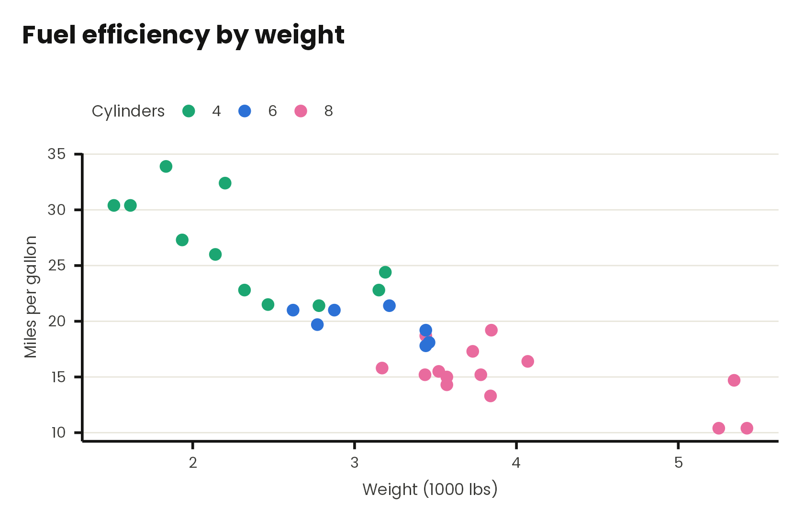
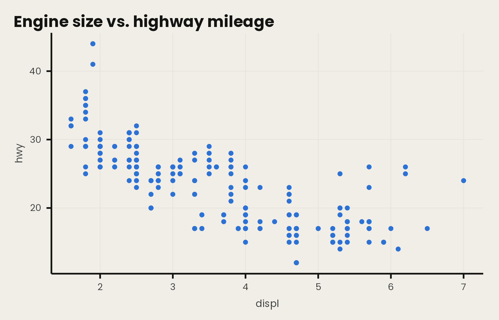
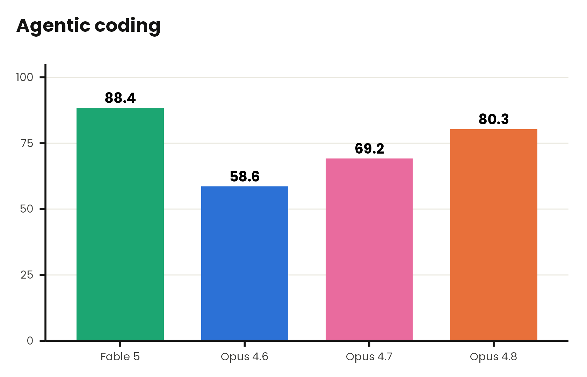
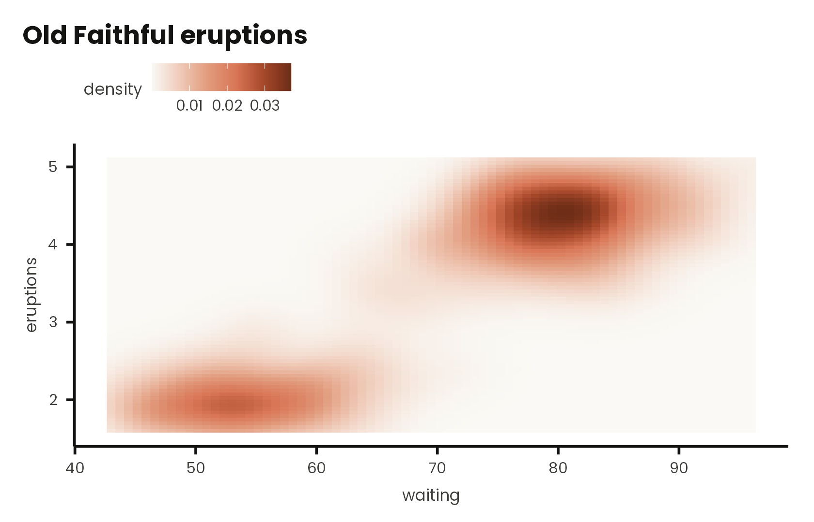
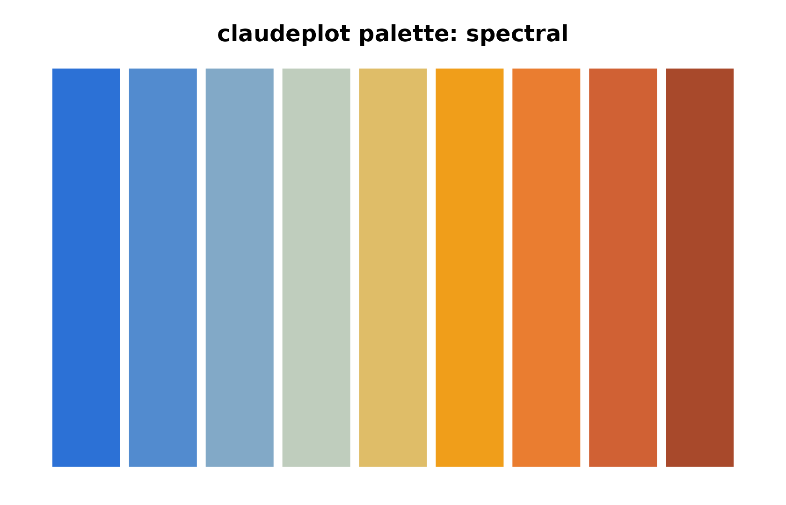
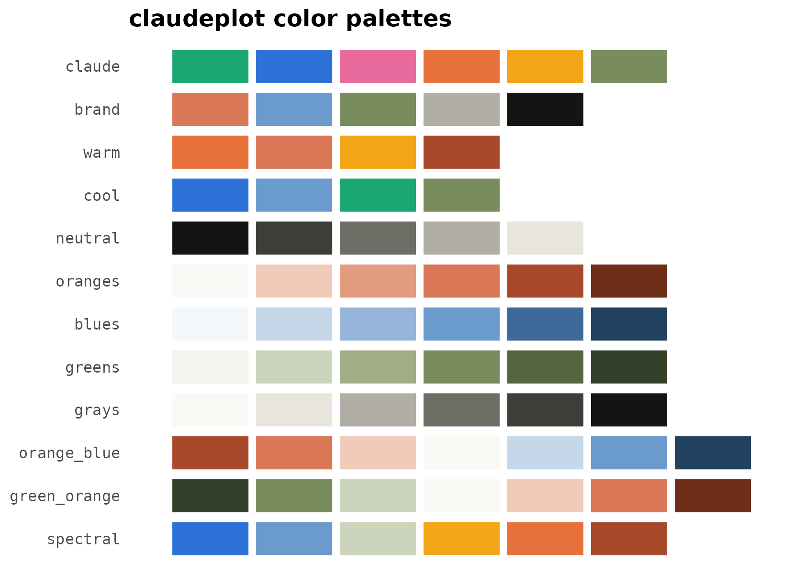

# Getting started with claudeplot

`claudeplot` brings the visual language of Anthropic and Claude to
`ggplot2`: a publication-ready theme, color palettes from Anthropic’s
brand and its data-visualization style, color/fill scales, and palette
helpers.

``` r

library(ggplot2)
library(claudeplot)
```

## The theme

[`theme_claude()`](https://viniciusoike.github.io/claudeplot/reference/theme_claude.md)
gives a light background, light horizontal grid lines, strong axis
lines, a bold Poppins title, and a serif Lora subtitle.

``` r

ggplot(mtcars, aes(wt, mpg, color = factor(cyl))) +
  geom_point(size = 3) +
  scale_color_claude_d() +
  labs(
    title = "Fuel efficiency by weight",
    subtitle = "Heavier cars travel fewer miles per gallon",
    x = "Weight (1000 lbs)", y = "Miles per gallon", color = "Cylinders"
  ) +
  theme_claude()
#> Warning in grid.Call(C_stringMetric, as.graphicsAnnot(x$label)): Unable to load
#> font: Lora
#> Warning in grid.Call(C_stringMetric, as.graphicsAnnot(x$label)): Unable to load
#> font: Lora
#> Warning in grid.Call(C_textBounds, as.graphicsAnnot(x$label), x$x, x$y, :
#> Unable to load font: Lora
#> Warning in grid.Call(C_textBounds, as.graphicsAnnot(x$label), x$x, x$y, :
#> Unable to load font: Lora
#> Warning in grid.Call.graphics(C_text, as.graphicsAnnot(x$label), x$x, x$y, :
#> Unable to load font: Lora
#> Warning in grid.Call.graphics(C_text, as.graphicsAnnot(x$label), x$x, x$y, :
#> Unable to load font: Lora
#> Warning in grid.Call.graphics(C_text, as.graphicsAnnot(x$label), x$x, x$y, :
#> Unable to load font: Lora
```



You can control the grid (`"y"`, `"x"`, `"xy"`, `"none"`), toggle the
axis lines, and switch to Anthropic’s warm off-white background:

``` r

ggplot(mpg, aes(displ, hwy)) +
  geom_point(color = claude_colors[["viz_blue"]]) +
  labs(title = "Engine size vs. highway mileage") +
  theme_claude(grid = "xy", background = "cloud")
```



## Color scales

Every scale comes in discrete (`_d`) and continuous (`_c`) forms, for
both `color`/`colour` and `fill`.

``` r

df <- data.frame(
  model = c("Opus 4.6", "Opus 4.7", "Opus 4.8", "Fable 5"),
  score = c(58.6, 69.2, 80.3, 88.4)
)

ggplot(df, aes(model, score, fill = model)) +
  geom_col(width = 0.7) +
  geom_text(aes(label = score), vjust = -0.5, fontface = "bold") +
  scale_fill_claude_d() +
  scale_y_continuous(limits = c(0, 100), expand = expansion(mult = c(0, 0.05))) +
  labs(title = "Agentic coding", subtitle = "SWE-Bench Pro (%)", x = NULL, y = NULL) +
  theme_claude() +
  theme(legend.position = "none")
#> Warning in grid.Call(C_textBounds, as.graphicsAnnot(x$label), x$x, x$y, :
#> Unable to load font: Lora
#> Warning in grid.Call(C_textBounds, as.graphicsAnnot(x$label), x$x, x$y, :
#> Unable to load font: Lora
#> Warning in grid.Call.graphics(C_text, as.graphicsAnnot(x$label), x$x, x$y, :
#> Unable to load font: Lora
#> Warning in grid.Call.graphics(C_text, as.graphicsAnnot(x$label), x$x, x$y, :
#> Unable to load font: Lora
#> Warning in grid.Call.graphics(C_text, as.graphicsAnnot(x$label), x$x, x$y, :
#> Unable to load font: Lora
```



Continuous scales interpolate the sequential and diverging palettes:

``` r

ggplot(faithfuld, aes(waiting, eruptions, fill = density)) +
  geom_raster() +
  scale_fill_claude_c(palette = "oranges") +
  labs(title = "Old Faithful eruptions") +
  theme_claude(grid = "none")
```



## Palettes

List the palettes, draw one, or draw them all:

``` r

claude_palette_names()
#>  [1] "claude"       "brand"        "warm"         "cool"         "neutral"     
#>  [6] "oranges"      "blues"        "greens"       "grays"        "orange_blue" 
#> [11] "green_orange" "spectral"
```

``` r

show_claude_palette("spectral", n = 9, type = "continuous")
```



``` r

show_claude_palettes()
```



The qualitative families are `claude` (the vivid benchmark palette),
`brand` (muted Anthropic accents), `warm`, `cool`, and `neutral`.
Sequential families are `oranges`, `blues`, `greens`, and `grays`;
diverging families are `orange_blue`, `green_orange`, and `spectral`.

## Fonts

claudeplot bundles Poppins and Lora and registers them with
`systemfonts` on load. They render on `ragg` and `svglite` devices;
check availability with:

``` r

claude_font_status()
#> 
#> ── claudeplot font status ──────────────────────────────────────────────────────
#> ✔ Poppins (headings): available
#> ✔ Lora (body/subtitle): available
#> ✔ systemfonts: installed
#> ✔ ragg: installed
#> ✔ `theme_claude()` will use Poppins and Lora automatically.
```

If a font is unavailable,
[`theme_claude()`](https://viniciusoike.github.io/claudeplot/reference/theme_claude.md)
falls back to generic `"sans"` and `"serif"` families, so plots always
render.
