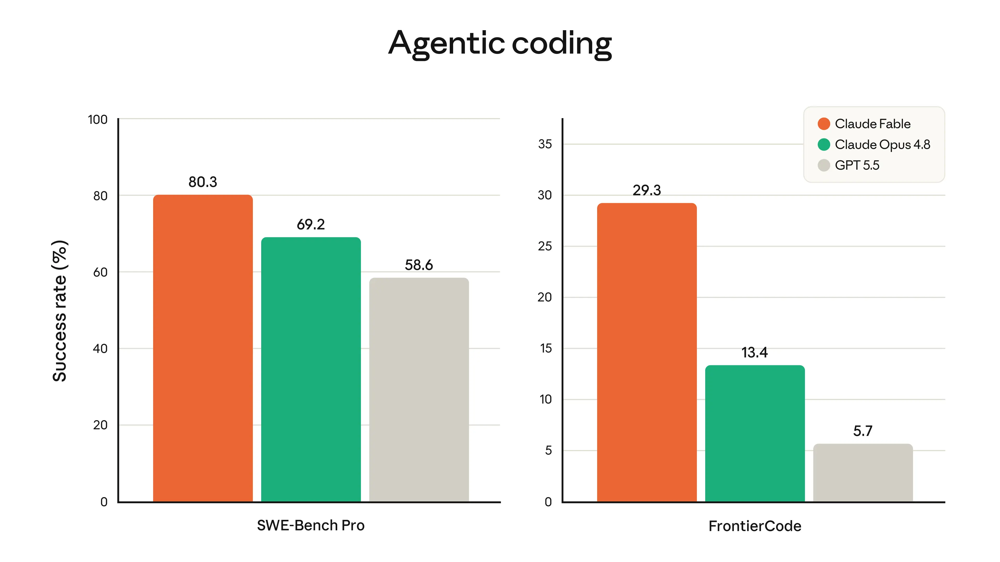

Anthropic's communication relies on sharp data visualization. This vignette will show how to replicate the general look of their charts using `claudeplot`.

```{r setup, message = FALSE}
library(ggplot2)
library(claudeplot)
```

# Agentic Coding benchmark

The first example comes from the [Claude Fable 5 announcement post](https://www.anthropic.com/news/claude-fable-5-mythos-5).



Anthropic's model announcements lean on a recognisable chart: grouped, rounded-top bars comparing models on a coding benchmark, labelled directly, with a clean horizontal-grid theme. This article rebuilds that look from the ground up with `claudeplot`, `gground`, and `patchwork`.

## The data

We can extract the data visually from the chart above.

```{r data}
dat <- data.frame(
  model = c("Claude Fable", "Claude Opus 4.8", "GPT 5.5"),
  benchmark = rep(c("SWE-Bench Pro", "FrontierCode"), each = 3),
  performance = c(80.3, 69.2, 58.6, 29.3, 13.4, 5.7)
)

dat
```

## Colors

The discrete scales (`scale_fill_claude_d()`) are the quickest way to colour a chart, but Anthropic's slides usually pick a deliberate accent per model. Pull specific colours straight from the palettes with `claude_palette()`:

```{r colors}
pal_cols <- c(
  claude_palette("warm")[1],
  claude_palette("claude")[1],
  claude_palette("brand")[4]
)

pal_cols
```

## Left panel

Each panel is a `geom_col_rounded()` chart with direct value labels in Poppins. The `theme_sub_*()` helpers (from ggplot2 4.0) let us tweak one part of the theme at a time: here we keep the bottom strip text as the benchmark label, drop the x-axis ticks and title, and bold the model names.

```{r panel, eval = requireNamespace("gground", quietly = TRUE)}
library(gground)

p1 <- ggplot(
  subset(dat, benchmark == "SWE-Bench Pro"),
  aes(model, performance, fill = model)
) +
  geom_round_col(radius = 4) +
  geom_text(
    aes(label = performance),
    size = 4,
    family = "Poppins",
    nudge_y = 5
  ) +
  scale_x_discrete(labels = c("", "\nSWE-Bench Pro", "")) +
  scale_y_continuous(
    breaks = seq(0, 100, 20),
    limits = c(NA, 100),
    expand = expansion(c(0, 0.05))
  ) +
  scale_fill_manual(values = pal_cols) +
  guides(fill = "none") +
  labs(y = "Success Rate (%)") +
  theme_claude() +
  theme_sub_axis(ticks = element_blank()) +
  theme_sub_axis_x(
    title = element_blank(),
    text = element_text(face = "bold")
  )

p1
```

## Right panel

The companion panel reuses the same recipe, but moves the legend inside the plotting area with `theme_sub_legend()` and swaps the legend glyph to points:

```{r panel-2, eval = requireNamespace("gground", quietly = TRUE)}
p2 <- ggplot(
  subset(dat, benchmark == "FrontierCode"),
  aes(model, performance, fill = model)
) +
  geom_round_col(radius = 4, key_glyph = "point") +
  geom_text(
    aes(label = performance),
    size = 4,
    family = "Poppins",
    nudge_y = 2
  ) +
  scale_x_discrete(labels = c("", "\nFrontierCode", "")) +
  scale_y_continuous(
    breaks = seq(0, 35, 5),
    limits = c(NA, 37),
    expand = expansion(c(0, 0.05))
  ) +
  scale_fill_manual(name = NULL, values = pal_cols) +
  guides(fill = guide_legend(override.aes = list(shape = 21, size = 3))) +
  labs(y = "Success Rate (%)") +
  theme_claude() +
  theme_sub_axis(ticks = element_blank()) +
  theme_sub_axis_x(
    title = element_blank(),
    text = element_text(face = "bold")
  ) +
  theme_sub_legend(
    position = "inside",
    position.inside = c(0.65, 0.9),
    direction = "vertical",
    background = element_rect(fill = "gray90", color = "gray80")
  )

p2
```

## Combining the panels

Finally, stitch the two panels together with `patchwork` and add a centred title themed with `theme_claude()`:

```{r combine, eval = requireNamespace("gground", quietly = TRUE) && requireNamespace("patchwork", quietly = TRUE)}
#| fig-width: 10
#| fig-height: 5
library(patchwork)

(p1 | p2) +
  plot_annotation(
    title = "Agentic coding",
    theme = theme_claude() + theme(plot.title = element_text(hjust = 0.5))
  )
```

That's the full Anthropic-style benchmark chart: rounded bars, hand-picked accent colours, direct labels in Poppins, and a clean `theme_claude()` base.

# Prediction

The following example replicates the Viral capsid experimental property prediction chart from the [Claude Fable 5 announcement post](https://www.anthropic.com/news/claude-fable-5-mythos-5).

## The data

To make the example more realistic, we will simulate a data distribution with similar characteristics.

```{r data-2}
set.seed(987123)

dat <- data.frame(
  model_name = rep(
    c("Claude Opus 4.8", "Claude Mythos Preview", "Claude Mythos 5"),
    each = 200
  ),
  value = c(
    (0.75 - rexp(200, 9)),
    rnorm(200, mean = 0.825, sd = 0.02),
    rnorm(200, mean = 0.85, sd = 0.02)
  )
)

lvls <- c("Claude Opus 4.8", "Claude Mythos Preview", "Claude Mythos 5")
dat$model_name <- factor(dat$model_name, levels = lvls)
```

Again, `gground` pairs nicely with `claudeplot` with the `geom_round_boxplot()` geom.

```{r}
ggplot(dat, aes(model_name, value, fill = model_name)) +
  geom_round_boxplot(
    linewidth = 0.25,
    width = 0.5,
    outliers = FALSE
  ) +
  geom_hline(
    yintercept = 0.5,
    linetype = "dashed",
    color = claude_colors[["graphite"]]
  ) +
  annotate(
    "text",
    x = 3,
    y = 0.48,
    label = "Protein language model baseline",
    family = "Poppins",
    size = 3,
    color = claude_colors[["graphite"]]
  ) +
  scale_fill_claude_d() +
  labs(
    title = "Viral capsid experimental property prediction",
    subtitle = "Unsupervised AAV packaging classification (reasoning alone)",
    x = NULL,
    y = "Score"
  ) +
  theme_claude() +
  theme_sub_legend(position = "none")
```

OBS: while `ggplot2` (>= 4.0.0) offers finer control of boxplot aesthetics, `geom_round_boxplot` currently doesn't support arguments like `box.color` or `staplewidth`.

Finally, to make a closer replication, use `stat = "identity"`.

```{r}
dat <- data.frame(
  model_name = c("Claude Opus 4.8", "Claude Mythos Preview", "Claude Mythos 5"),
  ymin = c(0.645, 0.82, 0.84),
  ymax = c(0.835, 0.855, 0.86),
  middle = c(0.79, 0.835, 0.855),
  upper = c(0.82, 0.845, 0.858),
  lower = c(0.735, 0.825, 0.845)
)

lvls <- c("Claude Opus 4.8", "Claude Mythos Preview", "Claude Mythos 5")
dat$model_name <- factor(dat$model_name, levels = lvls)
```


```{r}
ggplot(dat, aes(model_name, fill = model_name)) +
  geom_round_boxplot(
    aes(
      ymin = ymin,
      middle = middle,
      ymax = ymax,
      lower = lower,
      upper = upper
    ),
    linewidth = 0.25,
    width = 0.5,
    outliers = FALSE,
    stat = "identity"
  ) +
  geom_hline(
    yintercept = 0.7,
    linetype = "dashed",
    color = claude_colors[["graphite"]]
  ) +
  annotate(
    "text",
    x = 3,
    y = 0.48,
    label = "Protein language model baseline",
    family = "Poppins",
    size = 3,
    color = claude_colors[["graphite"]]
  ) +
  scale_y_continuous(
    breaks = seq(0.6, 0.9, 0.05),
    limits = c(0.6, NA)
  ) +
  scale_fill_claude_d() +
  labs(
    title = "Viral capsid experimental property prediction",
    subtitle = "Unsupervised AAV packaging classification (reasoning alone)",
    x = NULL,
    y = "Score"
  ) +
  theme_claude() +
  theme_sub_legend(position = "none")
```
